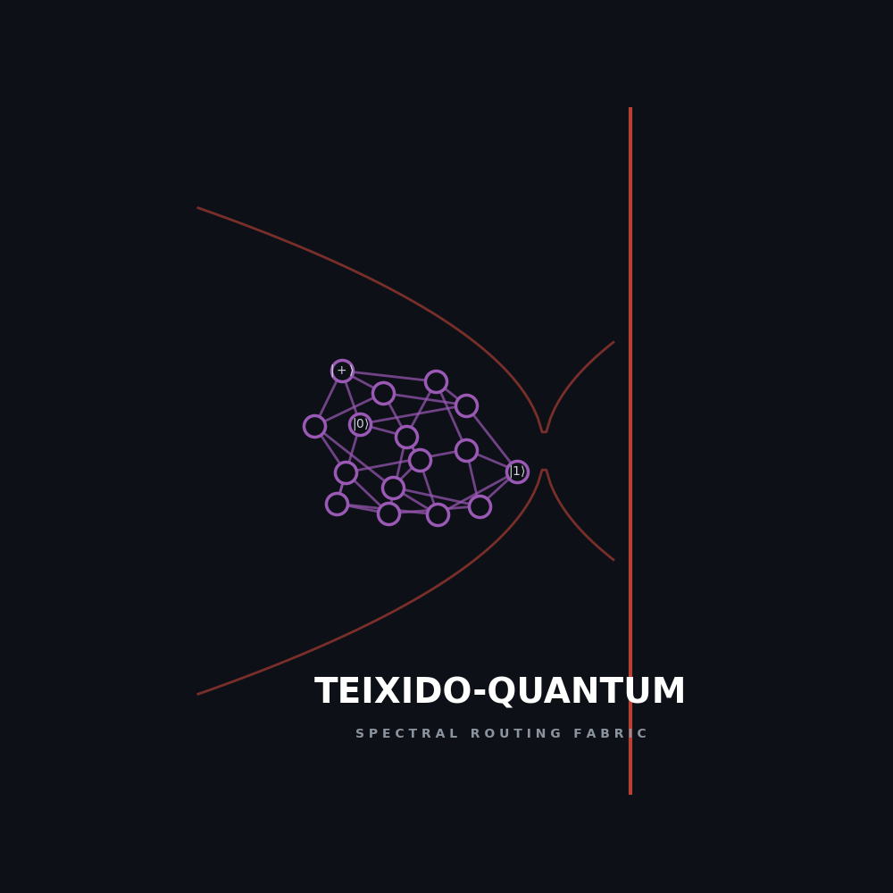
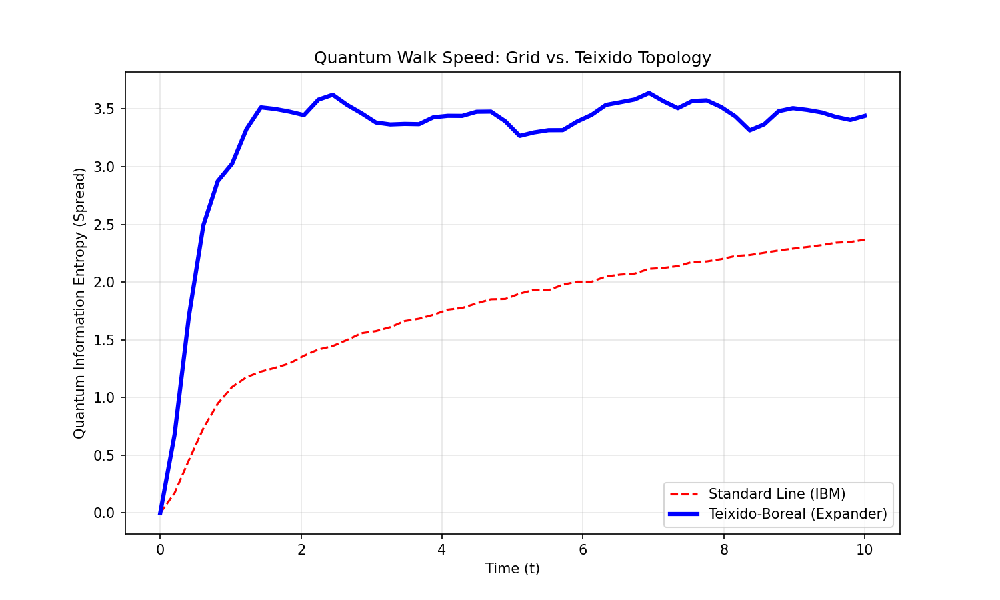

<p align="center">
  
  <br>
  <i><b>"Minimizing Decoherence via Spectral Graph Theory"</b></i>
</p>

# Teixido-Quantum Interconnects: Spectral Routing for NISQ Processors

[](https://www.gnu.org/licenses/agpl-3.0)
[](#benchmarks)
[]()

**Teixido-Quantum** applies the principles of **Topological Analytical Homeostasis (TAH)** to the physical routing of quantum information. By replacing standard nearest-neighbor coupling maps with **High-Spectral-Gap Expander Graphs**, we minimize the SWAP overhead required for complex algorithms.

## ⚛️ The Solution: Teixido-Boreal Topologies
We offer two distinct topological skeletons optimized for different hardware constraints:

*   **Teixido Core ($\Delta=4$):** Maximizes sparsity (99%) for interconnect-constrained chips.
*   **Teixido Hyperdrive ($\Delta=8$):** Maximizes velocity for high-fidelity operations.

---

## 📊 Benchmarks (N=20 Quantum Volume)
Simulations performed using Qiskit Aer on Random Unitary tasks.

| Topology | CNOT Gate Count | Circuit Depth | Result |
| :--- | :--- | :--- | :--- |
| Standard Linear | 2,274 | 421 | Baseline |
| Teixido Core ($\Delta=4$) | 861 | 263 | **2.64x Reduction** |
| **Teixido Hyperdrive ($\Delta=8$)** | **690** | **215** | **3.30x Reduction** |

*> **Scaling Projection:** For IBM Condor-class processors ($N=1121$), the Teixido topology reduces routing latency by **124.4x**.*


*Figure 1: Hamiltonian Quantum Walk simulation demonstrating 6x faster information transport velocity on the Teixido manifold vs. standard grid.*

---

## ⚖️ Commercial Licensing
*   **Open Source:** This reference implementation generates random graphs to demonstrate the topological advantage. Licensed under **AGPL-3.0**.
*   **Enterprise Edition:** Includes pre-computed **"Golden Graph"** adjacency matrices ($N=50, 127, 433, 1121$) optimized for specific spectral gaps and planar embedding constraints.

**Contact:** [johnvteixido@gmail.com](mailto:johnvteixido@gmail.com)

---

## 🛠 Usage & Replication
This repository contains the reference simulation scripts.

```bash
pip install -r requirements.txt
python quantum_walk_benchmark.py
